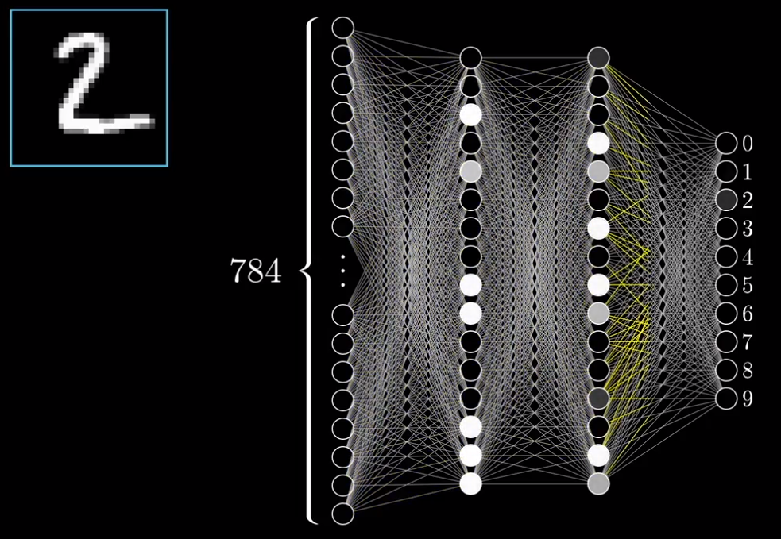

[toc]

- [视频集合地址]( https://www.youtube.com/watch?v=Ilg3gGewQ5U&list=PLZHQObOWTQDNU6R1_67000Dx_ZCJB-3pi&index=3 )
- 目标：了解神经网络的结构。

### 神经网络

- 神经网络中的神经暂时理解成：**一个用来装数字的容器，装着一个0到1之间的数字。**

  ```
  看例子 这个网络一开始的地方有很多神经元,分别对应了28x28的输入图像里的每一个像素,总计784个神经元.
  神经元中装着的数字代表对应像素的灰度值:0表示纯黑像素,1表示纯白像素,我们把神经元里装着的数 叫做"激活值"。
  
  网络的最后一层的十个神经元分别代表0到9这十个数字，它们的激活值同理都处在0到1之间，但这些值表示系统认为输入的图像对应着哪个数字的可能性
  
  神经网络运作的时候，上一层的激活值将决定下一层的激活值。所以说，神经网络处理信息的核心机制正是:
  一层的激活值是 通过怎样的运算,算出下一层的激活值。
  
  如果你在网络输入层的784个神经元处，输入了784个代表输入图像各像素的灰度值。那么 这层激活值的图案会让下层的激活值产生某些特殊的图案，再让再下层的产生特殊的图案，最终在输出层得到某种结果。输出层最亮的那个神经元就表示神经网络的"选择"。
  
  当我们人类在识别数字的时候，我们是在组合数字的各个部件。在理想的情况下，我们希望倒数第二层中的各个神经元，能分别对应上一个笔画部件，这样一来 当我们输入一个9或者8这种带圈的数字时，某一个神经元中的激活值就会接近1
  
  而且我并不特指某种样子的圈，我是希望 所有这种位于图像顶部的圆圈图案都能点亮这个神经元
  这样一来 从第三层到最后一层，我们只需要学习哪些部件能组合出哪个数字即可
  
  ```




### 总结

```
神经网络领域的"Hello World"
	这些数字书写在28乘28像素的网格上,每个网格对应一个0到1之间的灰度值,这些灰度值决定了，神经网络输入层的784个神经元的激活值，随后每一层的各个神经元的激活值都基于前一层的加权和与一个被叫做偏差的常数 相加 来获得.
	总之我们随意给出两个具有16个神经元的层,每一个神经网络有13000个可以调整的权重值和偏差,正是这些值决定了这个神经网络如何工作
```

