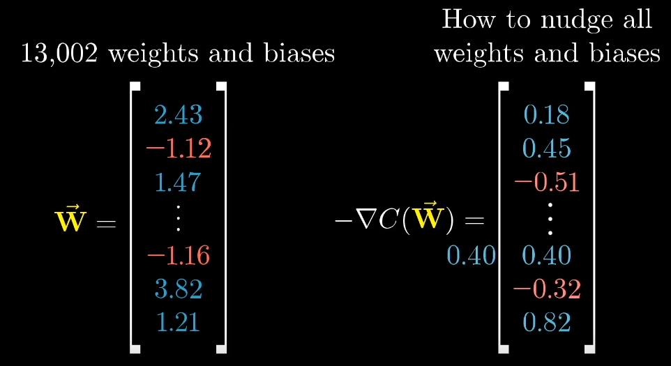
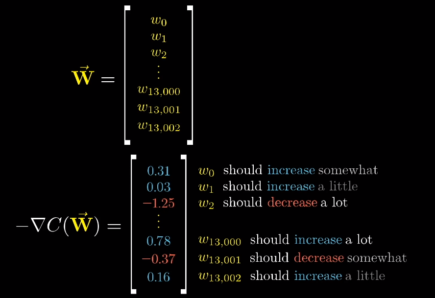
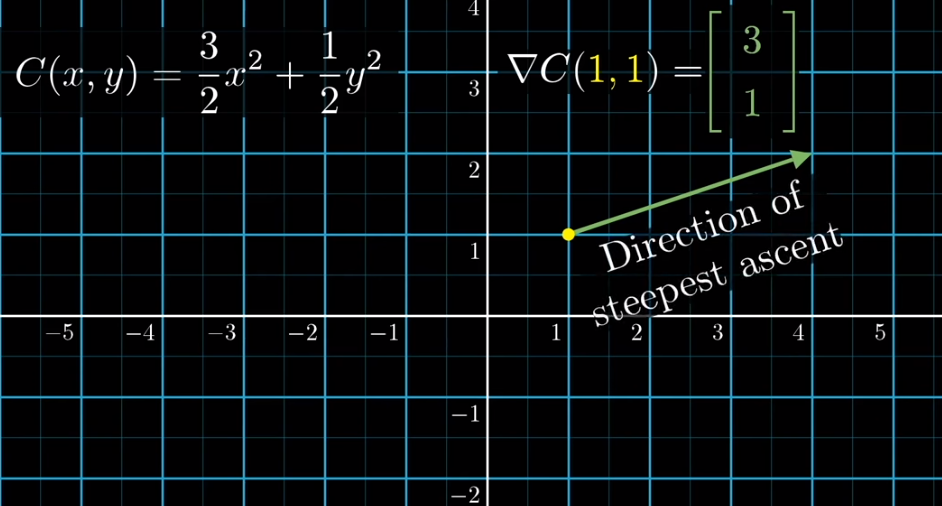
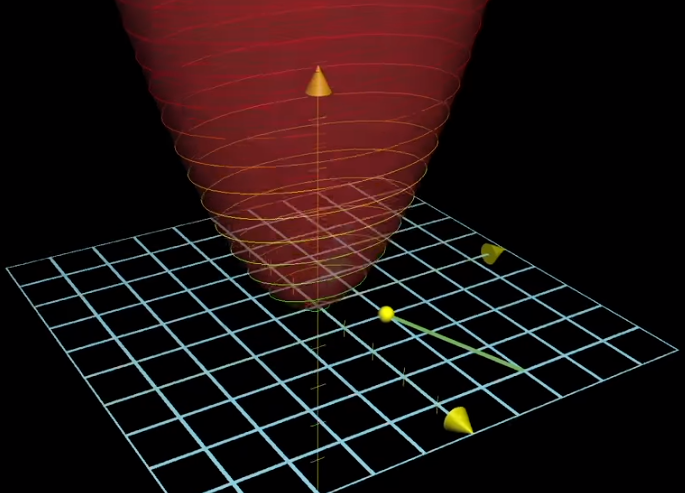
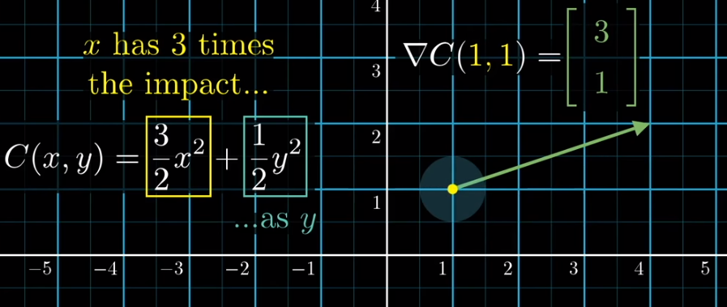

[toc]

[视频地址](https://youtu.be/f8PYXDsSBpM)

### 目标

	- 神经网络是如何通过数据来获得合适的权重和偏置的？
	- 介绍梯度下降的概念
	- 网络是如何工作的？以及这些隐藏的神经元层究竟在寻找什么？


### 重点

- 请记住，从概念上讲，我们认为每一个神经元都与前一层的所有神经元相连。`权重值`就像是**神经元间连接强度的参考值**，而`偏差值`则代表了某个神经元是**倾向于激活还是不激活并关闭**。

- 记住这个神经网络本质上是一个函数

  > 此网络将784个像素值数字作为输入,10个数字作为输出,从某种意义上来说,就是通过这些权重和偏差来参数化。

- 成本函数的复杂性表现在，将一万三千左右的权重和偏差值作为输入，并输出一个数字来反映这些权重和偏差质量的好坏。

- 多元微积分中函数的梯度对应的是:**函数最陡的增长方向**，也就是说 按着梯度的方向移动 函数值增长得越快，很自然 沿梯度的负方向走，函数值自然就降低得最快了。

  **梯度向量的长度**表示最陡斜率的陡峭程度是多少，最小化该函数的算法是计算这个梯度方向。
  
  



说明：

```
将网络的所有 13,000 个权重和偏置值整理成一个庞大的列向量,成本函数的负梯度是一个向量,这个无比庞大的输入空间里的某个方向,可以告诉我们所有这些数字的哪个值集合,将导致成本函数能最快地下降.
```


- **成本函数需要对所有训练数据取平均值**,如果能最小化成本函数，意味着在所有这些样本上取得的效果更好，
- 高效计算这个梯度的算法称为**反向传播**


### 单个训练数据会具体让每个权重和偏置产生怎样的变化？

- 当我们提到网络学习时，实际上就是最小化成本函数，而为了达到这个结果，这个成本函数必须具有很平滑的输出，这样我们才能每次挪一点点 找到局部最小值。

  这也顺便解释，为什么人工神经元的激活值是连续的，而不是直接沿袭生物学神经元那种二元式的，要么激活要么非激活的取值模式。

- 按照负梯度的倍数，重复调整函数输入值的过程称为**梯度下降法**。它是一种向成本函数的局部最小值收敛的方式。



```
负梯度的每一项告诉我们两项信息
1.正负号告诉我们:输入向量的相应分量,应该升高还是降低.
2.这些分量的相对大小,告诉我们哪些更改更重要
```


​    举个简单的例子，假设某个函数有两个输入变量，计算某个点的梯度，结果是 [3,1]。一方面可以解释为：
**当你处在该输入点时，朝着这个方向移动能够最快地增大函数。**



当你对输入平面上方的函数绘制图形时，该向量将告诉你垂直朝上的方向能够最快地增大函数。




​	另一种解读方式是，对第一个变量的更改重要性比对第二个变量的更改要高三倍。至少对于这个相对输入来说,调整 X 值对你来说影响力更大。




### 总结：

​	成本函数的梯度能告诉我们所有这些权重和偏置值的`那一部分值集合`可导致成本函数的值变化最快，
可以解读为对哪些权重的哪些更改影响最大

换句话说，即使该网络能够很准确地识别数字，但它根本不知道如何绘制这些数字，这是因为它是严格受限的训练设置。站在网络的角度看，整个世界只包含定义清晰的不移动数字，而成本函数从未提供表示任何结果的任何激励。

