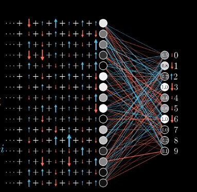

[toc]

[视频地址](https://s3.cn-north-1.amazonaws.com.cn/u-vid-hd/Wr5qCQ48t8E.mp4)

激活值是：把前一层所有激活值的加权和 加上一个偏置，再通过sigmoid ReLU之类的挤压函数算出来的。

增加这个激活值有三种方式：一增加偏置、 二增加权重、三改变上一层的激活值

请记住当说到梯度下降的时候，并不只看每个参数是该增大还是减小，还看该哪个参数的性价比最高。

把数字2神经元的期待和别的输出神经元的期待全部加起来，作为对如何改变倒数第二层神经元的指示。这些期待变化不仅是对应的权重的倍数，也是每个神经元激活值改变量的倍数。这其实就是在实现”反向传播”的理念。

把所有期待的改变加起来，就得到了一串对倒数第二层改动的变化量。
有了这些，就可以重复这个过程，改变影响倒数第二层神经元激活值的相关参数，在从后一层到前一层，指导循环到第一层。