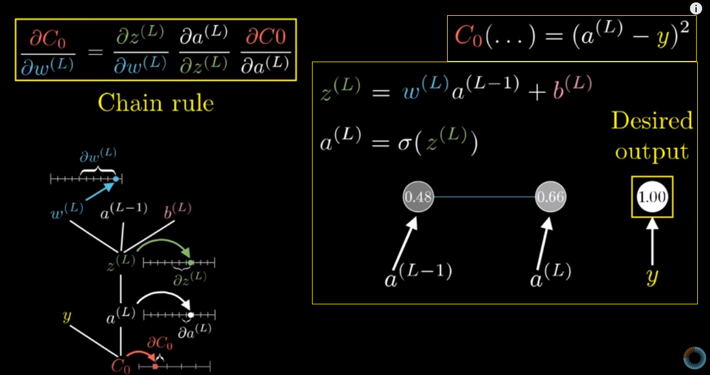

[toc]

目标：在机器学习中是怎么理解链式法则的

[视频地址](https://www.youtube.com/watch?v=tIeHLnjs5U8&list=PLZHQObOWTQDNU6R1_67000Dx_ZCJB-3pi&index=4)

我们的目标是理解代价函数对于这些变量有多敏感,这样 我们就知道怎么调整这些变量,才可以使得代价降低得最快.

### 第一个目标
1. 第一个目标是理解代价函数对权重w^(L)的微小变化有多敏感，或者换句话讲  求C对w^(L)的导数。
2. 当你看到∂w之类的项时：请把它当做这是对w的微小扰动  好比变个0.01，然后把∂C当做 “改变w对C的值造成的变化”。我们求的是这两个数的比值，概念上说  w^(L)的微小变化会导致z^(L)产生些变化，然后会导致a^(L)产生变化  最终影响到代价值。

就最后这个导数来说，∂w权重的改变量对最后一层的影响有多大，取决于之前一层的神经元。

链式法则导数形式:描述的是 代价函数 对某个权重 的敏感度。

链式法则表达式给出了决定梯度每个分量的偏导，使得我们能不断下探  最小化神经网络的代价。