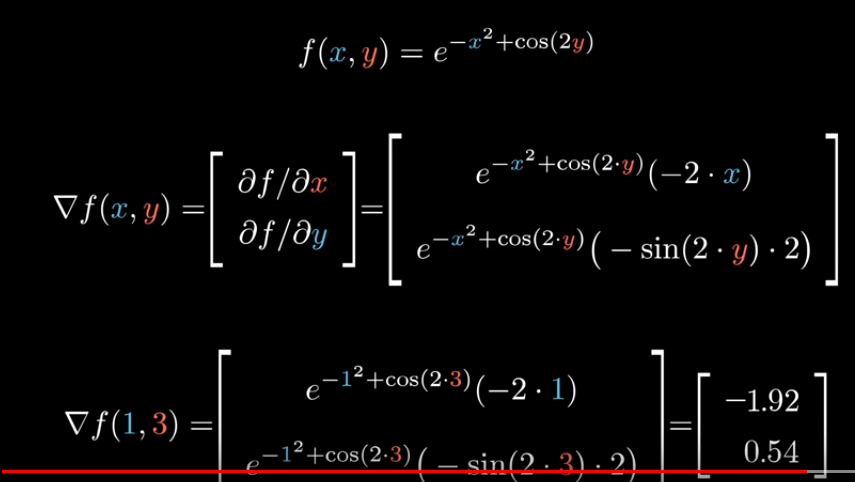

[视频地址](https://www.youtube.com/watch?v=_K7lzXqyj8I&feature=youtu.be)

梯度适用于有多个不同输入但是只有一个输出的函数

函数的梯度原理是：在特定的输入点，它会给出在输入空间里，哪个向量能够指向最陡上升方向，也就是朝着哪个方向走动能够最快地上山，且这些向量的大小表示山坡的陡峭程度。

意思是如果站在点 (1,3)，那么能够最快地增大此函数值的方向是，x 方向是个很大的负值，而 y 方向是个很小的正值。

无论你处在此平面的哪个位置，通过计算偏导数得出的这个梯度函数，都将告诉你上山最快的方向。