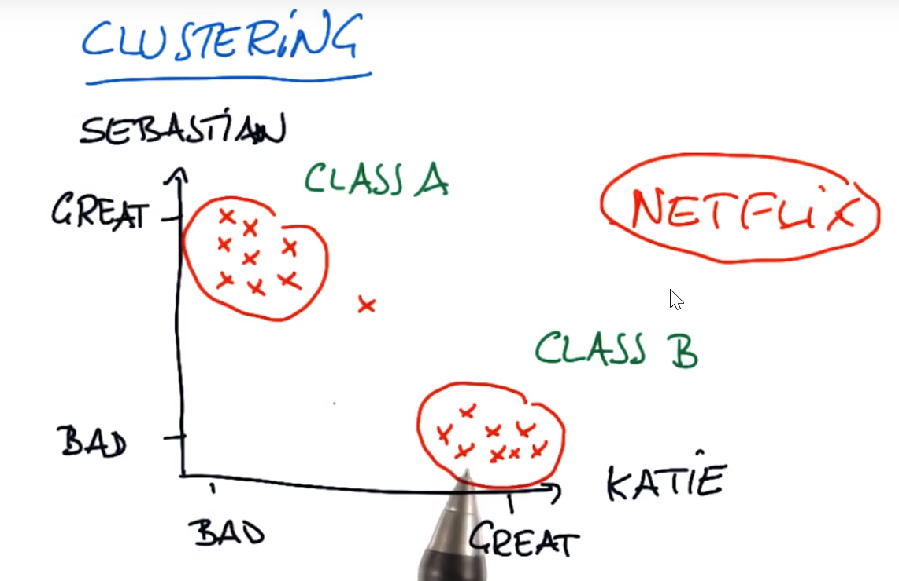
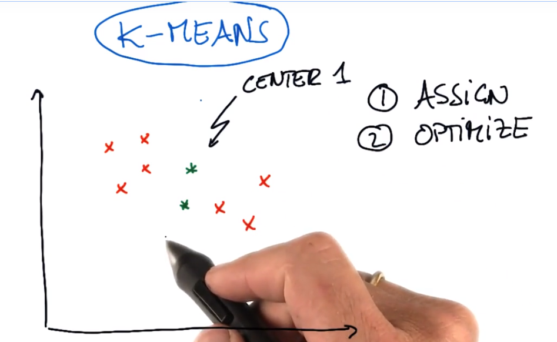
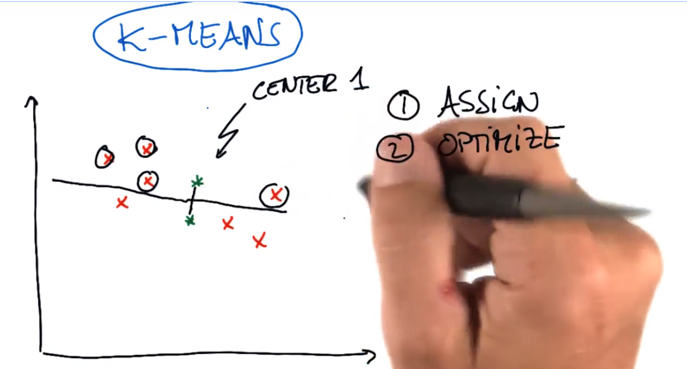
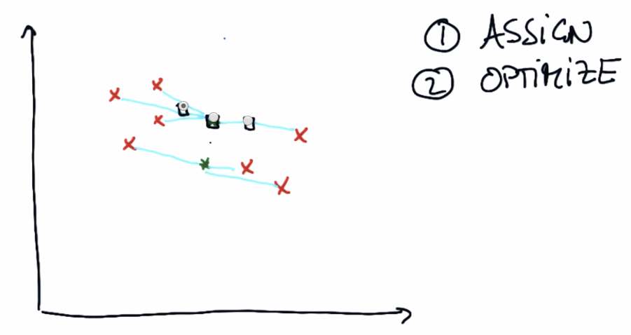
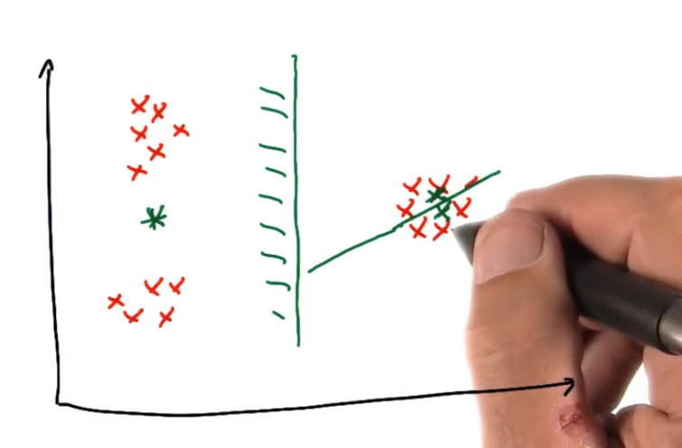
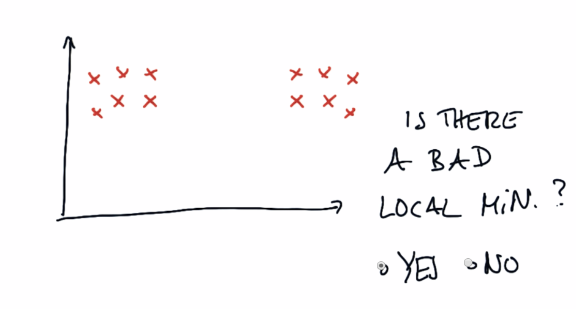
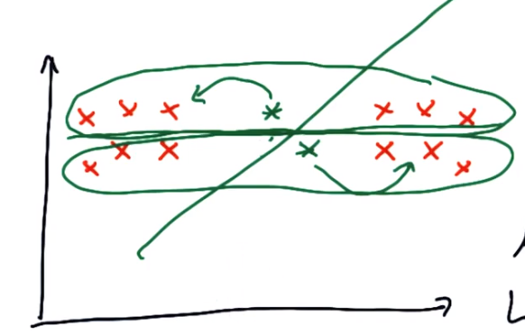

[TOC]

# 非监督学习（Unsupervised Learning）

​	因为大多数情况下，从现实世界获取的数据并不附有标记，也就说不能告诉我们正确答案。在这种情况下，只有采用非监督技术，才能从数据中有所收获。

# 聚类（clustering）

​	聚类是通过发现数据的规律，从而区分出不同类别数据。

> **Sebastian** ,**Katie**  是人名。

# 匹配

	- 在 k-均值算法中，通常先先随意画出聚类中心，然后在匹配和优化。
	- **如何能准确选择距离中心 1 比中心 2 更近的红色点？**

## K-Means分类方法

# 优化

优化的是将`聚类中心`到这些点的，总二次距离降到最小.

# K-Means可视化

 https://www.naftaliharris.com/blog/visualizing-k-means-clustering/

# sklearn-KMeans重要参数

    -  k-Means聚类的工作原理基于 **各点之间的距离**。
   -  重要参数如下：
          -  n_clusters   设置`聚类`的数量，确定`聚类数量`是使用 k-均值 时最具挑战的工作之一。
          -   n_init          设置`不同初始化的数量`。 由于算法取决于`初始状况`，因此需要多次重复`初始化`。
          -  max_iter     设置算法最大迭代次数。

[scikit-learn K-Means](https://scikit-learn.org/stable/modules/generated/sklearn.cluster.KMeans.html)

[scikit-learn Clustering](https://scikit-learn.org/stable/modules/clustering.html)

# K-Means局限

- 一个固定的数据集 一个固定数量的簇中心，在运行k-均值算法时 是否总是会得到相同的结果？

  不会得到相同结果，因为K-均值是所谓的爬山算法，因此它非常依赖于你的初始聚类中心所处的位置。

# 反直觉聚类

下图是K-Means存在的**局部最小值**.它取决于聚类中心点的最初设定。

**下图是否存在局部最小值？**

答案

